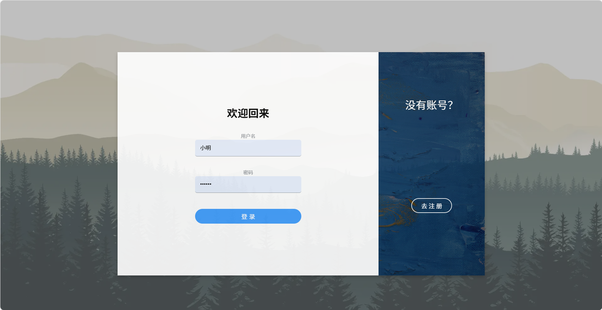
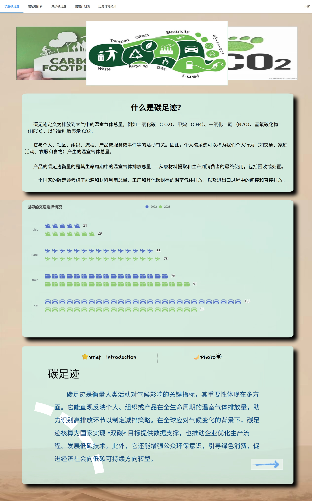
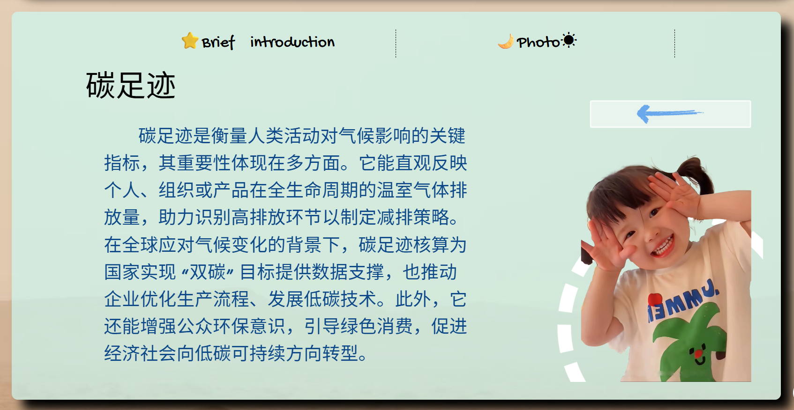
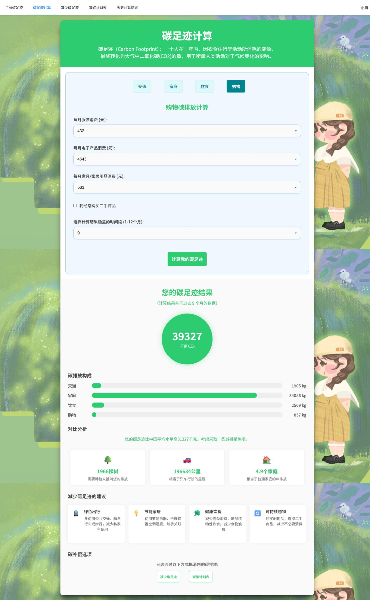
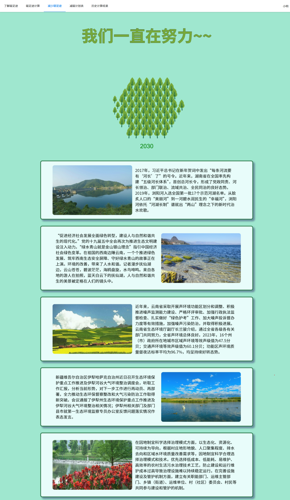
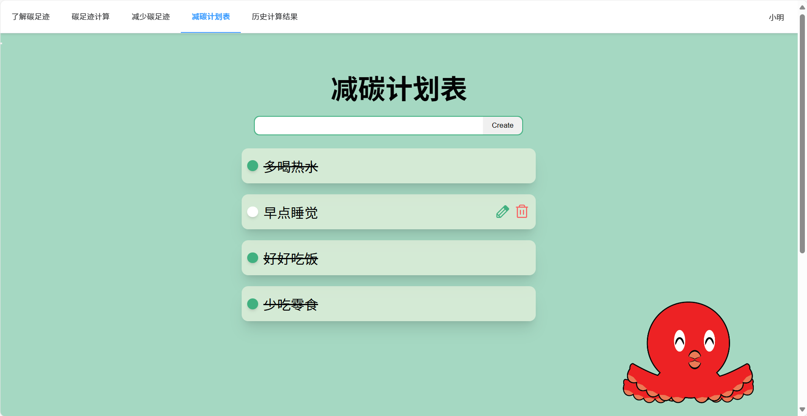
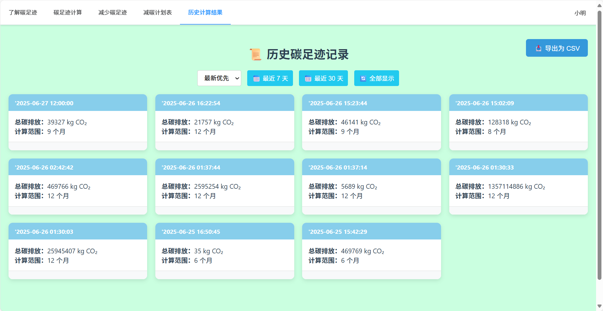
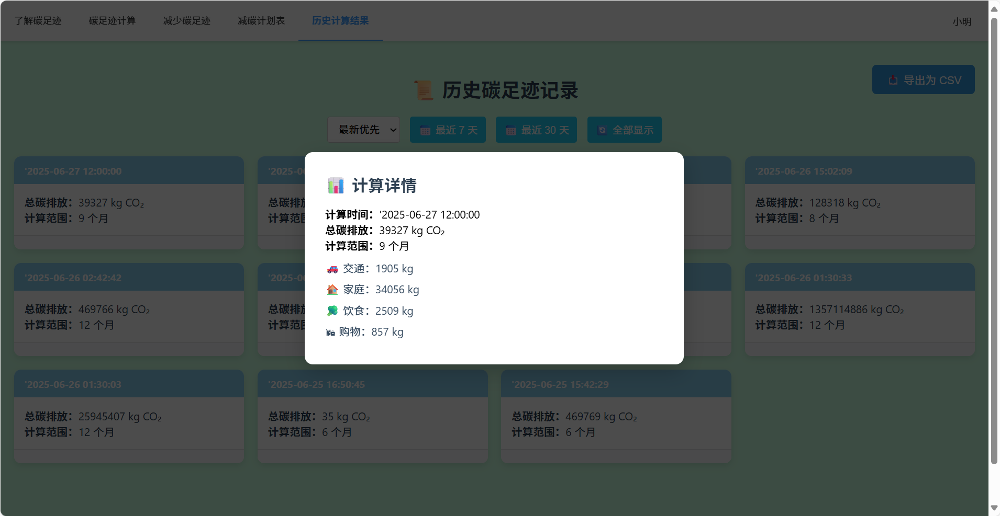

碳足迹计算器课程项目
=======

本项目前端部分模板来自Github上一位开源仁兄，特别感谢！！！

在原有前端模板上接入了后端增加并完善了一些功能。

## 原文

[Commits · Jenny-Tany/Carbon_foot](https://github.com/Jenny-Tany/Carbon_foot)


# 前端部分

使用vue3构建的web页面，在原有模板上添加了登陆注册功能、碳足迹计算功能和历史计算结果展示导出功能。

### 界面展示


















### 项目启动

进入前端项目文件夹：Carbon_foot

```
npm install
```

```
npm run dev
```


## 后端部分

使用Golong语言写了对应功能的接口，详情见 接口文档.html

### 项目启动

配置好Golong环境后启动  main.go 文件
